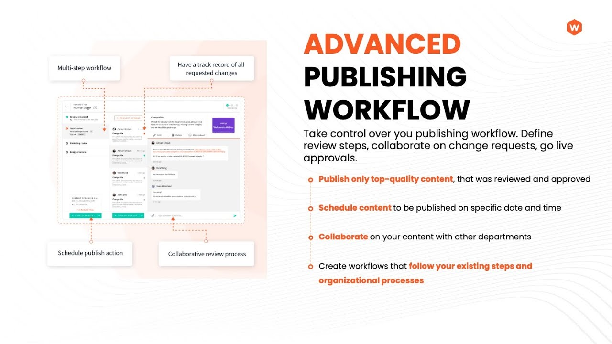

import { Alert } from "@/components/Alert";

<Alert type="success" title="WHAT YOU'LL LEARN">

- what is Advanced Publishing Workflow
- what is its purpose and benefits

</Alert>

## What is Advanced Publishing Workflow?

The Advanced Publishing Workflow feature in Webiny empowers you to seamlessly integrate a robust review system into your application. This feature serves to optimize the content creation process, offering effective tools for reviewing, approval, and collaboration among team members. By incorporating this workflow into your application, you ensure a comprehensive approach that enhances content quality and fosters seamless collaboration.

## Advanced Publishing Workflow Benefits:

1. Define Publishing Workflows:

    - Easily configure and customize publishing workflows tailored to your specific content creation and review requirements.
    - Define sequential steps and approval stages to ensure a structured and efficient review process.

2. Overview of Pending Reviews:

    - Access a centralized dashboard providing a comprehensive overview of all pending reviews requiring your input.
    - Streamline your workflow by quickly identifying and prioritizing tasks that need your attention.

3. Daily Digest of Pending Activities:

    - Receive a daily summary of pending activities, ensuring you stay informed about ongoing reviews without the need for constant monitoring.
    - Stay organized and proactive with a concise summary of tasks requiring your action.

4. Collaborate with Multiple Peers:

    - Foster collaboration by involving multiple peers at different organizational levels in a structured peer review process.
    - Leverage the platform to facilitate communication and coordination among team members during the review and approval stages.

5. Scheduled Publishing and Unpublishing:

    - Plan and organize content releases with the ability to schedule page publishing and unpublishing activities.
    - Ensure timely publication of content while maintaining control over the visibility and availability of your pages.

These benefits collectively contribute to a more streamlined and effective content creation and review process, enhancing collaboration, organization, and overall efficiency within your Webiny application.

