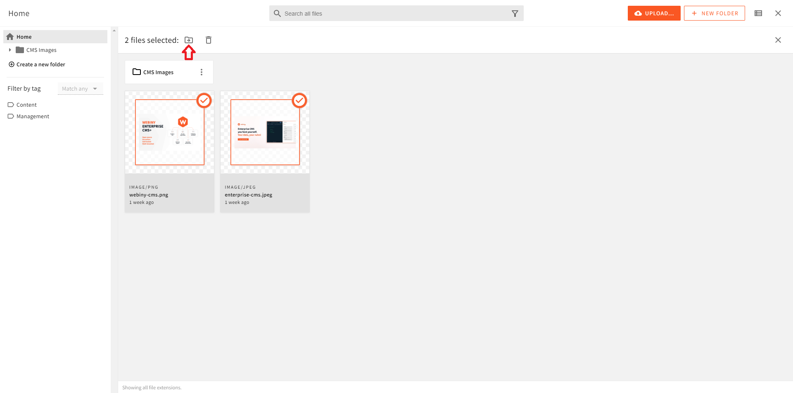

import { Alert } from "@/components/Alert";

<Alert type="success" title="WHAT YOU'LL LEARN">

- how to move multiple files from one folder to another

</Alert>

Webiny enables users to execute bulk actions, such as moving and deleting multiple files simultaneously. In this tutorial, we will learn how to move multiple files from folder to another.

1. From the **Side Menu**, click **File Manager**.

    ✔️ The **File Manager Home** screen opens.

2. In the root folder, create a folder titled **CMS Images**.

    **Note**: If you are not familiar with how to create a folder, please follow the [Organizing Files](../file-manager/organizing-files) tutorial.

3. In the root folder, over the **Webiny CMS** image we uploaded in the [File Upload](../file-manager/upload-file) tutorial, click the **SELECT** icon (☑️).

    ✔️ A file action bar appears below the search bar.

4. Similarly, select the **Enterprise CMS** image we uploaded in the [Tagging Files](../file-manager/upload-file) tutorial.

5. In the file action bar, click the **MOVE *N* FILES** icon (📁).

    ✔️ The **Select folder** screen appears.

6. In the menu, click **CMS Images**.

7. Click **MOVE**.

    ✔️ The **Move files** dialog box appears with the message "Finished moving files! See full report below".

    