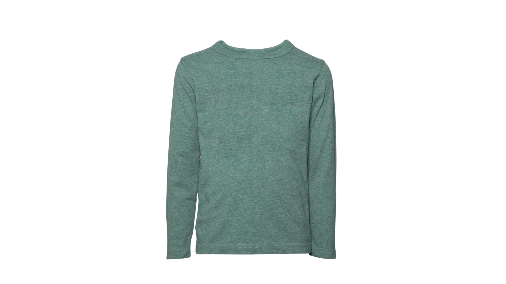

import { Alert } from "@/components/Alert";

<Alert type="success" title="WHAT YOU'LL LEARN">

- how to create folders and sub-folders

</Alert>

Webiny simplifies content organization by allowing users to create folders and sub-folders, making it easier to manage. In this tutorial, we will learn how to organize your files in folders and sub-folders in the File Manager. We will do this in 3 steps:

- Step 1: Create a folders
- Step 2: Create a sub-folder
- Step 3: Upload an image

## Step 1: Create a folder

1. From the **Side Menu**, click **File Manager**.

    ✔️ The **File Manager Home** screen opens.

2. In the navigation panel on the left, click **➕Create new folder** 
    (Or, in the header section, click **➕NEW FOLDER**).
    
    ✔️ The **Create a new folder** screen opens.

3. In the **Title** textbox, type **Clothes**.

4. In the **Slug** textbox, type **clothes**.

5. In the **Parent folder** menu, click **Home**.

6. Click **CREATE FOLDER**.

    ✔️ The message "Folder created successfully!" displays.

## Step 2: Create a sub-folder

1. In the navigation panel on the left, click **➕Create new folder**.

    ✔️ The **Create a new folder** screen opens.

2. In the **Title** textbox, type **Men's**.

3. In the **Slug** textbox, type **mens**.

4. In the **Parent folder** menu, click **Clothes**.

6. Click **CREATE FOLDER**.

    ✔️ The message "Folder created successfully!" displays.

## Step 3: Upload an image

We will upload the following image in this step. Please save it on your computer to upload.

1. In the navigation panel on the left, click **Men's**.

    ✔️ The **Men's** folder opens.

    **Note**: You can go to any folder by clicking its title in the navigation panel on the left.

2. Click **UPLOAD...**.

    ✔️ The file explorer screen opens.

3. From the file explorer, upload the image.

    ✔️ The message "File upload complete." displays.
