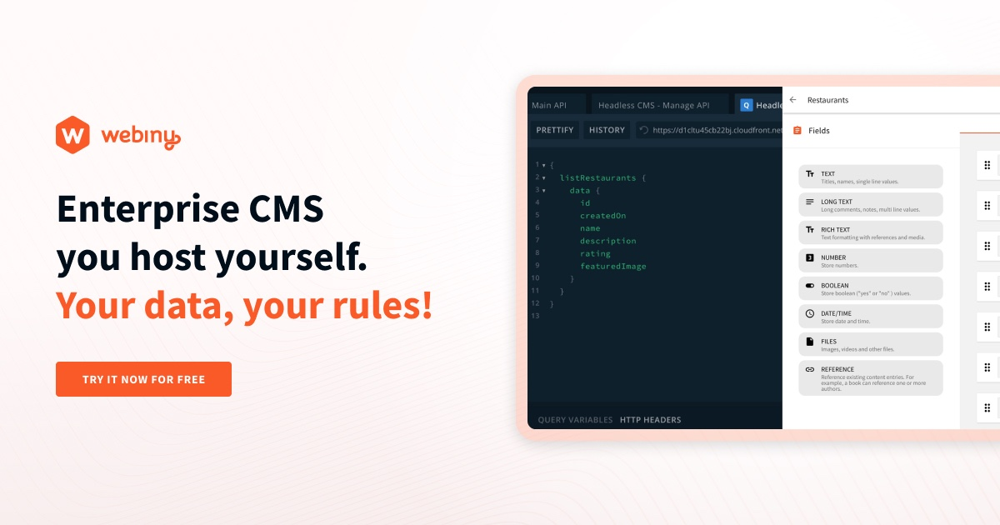

import { Alert } from "@/components/Alert";

<Alert type="success" title="WHAT YOU'LL LEARN">

- how to upload a file in File Manager

</Alert>

Webiny allows users to tag files, facilitating convenient access. Users can efficiently search and filter files based on assigned tags. In this tutorial, we will learn how to tag a file, and filter it via its assigned tag. We will do this in 2 steps:

- Step 1: Tag a file
- Step 2: Filter the file through its assigned tag

## Step 1: Tag a file.

1. From the **Side Menu**, click **File Manager**.

    ✔️ The **All files** screen opens.

2. Hover over the **Webiny CMS** image we uploaded in the [File Upload](../file-manager/upload-file) tutorial.

3. Click the **SETTINGS** icon (⚙️).

    ✔️ The **File details** screen opens.

4. In the **Tags** textbox, type **Content**.

5. In the drop-down below, click **Content**.

6. Click **SAVE FILE**.

7. Now upload the following image, and following the Steps 2 to 6, add **Management** tag to the file.

    

If you are not familiar with how to upload a file, please follow the [File Upload ](../file-manager/upload-file) tutorial.

## Step 2: Filter the file through its assigned tag

1. On the **All files** screen, in the navigation panel on the left, below **Filter by tag**, click **Content**.

    ✔️ All the files with the tag **Content** appear on the screen.

OR

1. On the **All files** screen, click the **Search all file** search bar.

2. In the **Search all file** textbox, type **Management**.

    ✔️ All the files with the tag **Management** appear on the screen.

    